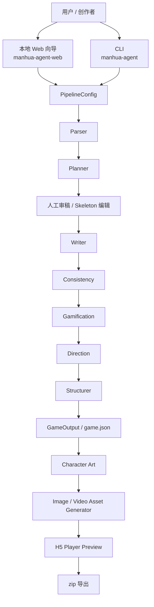
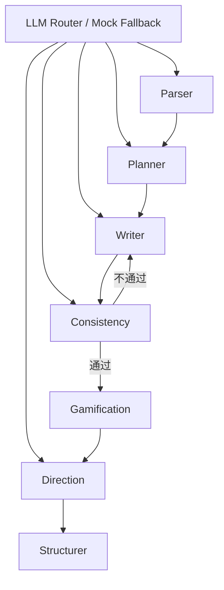

# 互动漫剧游戏生成智能体（Interactive Manhua Game Agent）

> 一个把“小说 / 关键词”自动转成可玩互动漫剧游戏的多 Agent 创作引擎：既能跑 CLI 批量生成结构化 `game.json`，也能通过本地 Web 向导完成人工审稿、题材化演出预览与一键导出。

---

## 项目简介

短漫剧行业已经在“看”的环节被 AI 大幅压缩成本，但“玩”的环节仍高度依赖人工：要手写分支剧情、设计选择节点、补道具条件、安排演出节奏，还要考虑最终是否能落成一个可预览、可导出的互动作品。

`interactive-manhua-agent` 试图把这条链路标准化。它以多 Agent 串行流水线为核心，把长文本改编或关键词原创转成结构化互动剧情，再补齐一致性校验、轻量玩法、题材化演出、角色与场景素材、H5 预览和 zip 导出能力。项目的定位不是“写一段剧情 demo”，而是提供一套从故事输入到可试玩产物的本地创作工作台。

当前最新版为 **v1.3.1**：在既有 P1 Web 工作流基础上，进一步完成了方案 B 视觉主题升级、跨题材个性化表达、低成本模型友好提示词重写、无 API Key 自动 Demo Mode，以及前端静态资源打包修复。

---

## 核心能力

### 1. 双入口创作：CLI 引擎 + 本地 Web 产品

- **功能**：同时提供 `manhua-agent` 命令行入口和 `manhua-agent-web` 本地向导入口。
- **解决的问题**：纯 CLI 适合研发与批量生成，但不适合创作者审稿与调参；纯 GUI 又难以承载工程化流水线。
- **价值**：研发可以直接落盘 `game.json`，创作者可以在浏览器中完成“生成 → 审阅 → 预览 → 导出”闭环。

### 2. 多 Agent 串行流水线生成互动剧情

- **功能**：核心链路为 `Parser → Planner → Writer → Consistency → Gamification → Direction → Structurer`。
- **解决的问题**：单次 LLM 直出容易出现结构散、分支撞车、选择无后果、演出字段缺失等问题。
- **价值**：把“设定提取、剧情规划、正文生成、结构校验、玩法挂载、演出设计、最终组装”拆成明确职责，便于控制质量与迭代单环节能力。

### 3. Planner 后 HITL（Human in the Loop）人工介入

- **功能**：Web 模式下，任务会在 Planner 完成后暂停，前端可直接编辑分支标题、冲突源、节拍大纲、关键道具，再确认继续。
- **解决的问题**：创作者最在意的不是“AI 能不能生成”，而是“骨架对不对、分支值不值得继续写”。
- **价值**：把人工介入放在最该介入的位置，减少整条链路重跑的浪费。

### 4. 题材感知的视觉导演与动静混合素材策略

- **功能**：Direction Agent 会根据题材推断 `VisualTheme`，输出 `ui_variant`、`stage_effect`、`theme_tags`、`visual_motifs`、粒子类型、图像 / 视频 prompt 等题材化演出字段；素材模块再基于 `VIDEO_RATIO` 自动决定哪些节点做视频、哪些做静态图。
- **解决的问题**：同一个剧情结构如果只换文案、不换视觉语法，最终成片很难建立题材差异；素材成本也容易失控。
- **价值**：在“更像该题材”与“成本可控”之间取得平衡，让古风、民国、都市、悬疑、科幻、玄幻等题材都能快速落成可演示版本。

### 5. 无 API Key 也能完整跑通 Demo 通路

- **功能**：未配置 `LLM_API_KEY` 时，Web 端会自动强制切入 `dry_run` / demo 模式，仍然产出完整节点、主题化视觉参数和预览链路。
- **解决的问题**：很多本地体验失败不是逻辑有问题，而是环境还没配好。
- **价值**：即便用户暂时没有模型或素材 API，也能快速验证工作流、主题风格和交互体验。

### 6. 面向交付的 H5 导出

- **功能**：可将生成结果打包为含 `index.html`及素材目录的 zip。
- **解决的问题**：只生成 JSON 还不能直接给业务方试玩，导出后还要再拼播放器与静态资源。
- **价值**：导出静态H5原型可本地双击游玩，为后续正式开发给出MVP指导。

---

## 最新版（v1.3.1）重点更新

### v1.3.x 做了什么

- **方案 B 视觉主题升级**：`VisualTheme` 从单纯换色升级为完整题材视觉配置，包含 palette、场景渐变、粒子、字体、`ui_variant`、`stage_effect`、`theme_tags`、图像 / 视频 prompt 等字段。
- **跨题材个性化升级**：Direction Agent 内置古风、民国、都市、赛博、悬疑、玄幻等主题预设，播放器根据主题自动切换 UI 包装和舞台特效。
- **低成本模型友好提示词重写**：`system_prompts.py`、`writer.py` 等将提示词改写为更硬约束、更强调镜头感和成片意识的结构，降低便宜模型跑偏概率。
- **无 Key 自动 Demo Mode**：Web 端未检测到 LLM 可用时会自动启用 demo 模式，保证整条可视化通路可体验。
- **1.3.1 打包修复**：修复 `whl` 安装场景下 Web 静态资源未被正确打入包的问题，确保 `manhua-agent-web` 安装后即可正常托管前端页面。

---

## 效果展示

**输入示例 1：关键词原创**

```text
关键词：古风、权谋、复仇、双女主
主题：女主在王府旧案与新朝夺权之间做选择
```

**输入示例 2：小说改编**

```text
上传一段长篇小说文本，自动提取设定、主冲突、分支骨架，再生成互动剧情节点。
```

**输出结果**

```text
1. 结构化 GameOutput / game.json
2. 分支节点、变量、道具、结局、Scene/BGM/CG/Voiceover 等资产字段
3. VisualTheme 题材化演出配置
4. 本地 H5 播放器预览
5. 可下载 zip 包（index.html + player + game-data.js + assets/）
```

> 如需更细的 P1 产品设计与前后端方案，可继续阅读 [README_P1.md](README_P1.md)。

---

## 应用场景

- **漫剧内容团队做低成本原型验证**：先用关键词快速生成多分支互动玩法，判断题材是否值得投入正式生产。
- **小说 / 剧本改编为互动版试玩稿**：将现成长文本改造成可选择、可预览、可导出的互动剧情骨架。
- **创作者个人工作流提效**：把“世界观梳理、分支规划、文本展开、演出字段补齐”从手搓改为半自动。
- **业务评审 / 路演演示**：不只展示设定文档，而是直接给出可点击体验的 H5 成品草稿。

---

## 安装部署

### 环境要求

- Python 3.9+
- 建议使用虚拟环境（`venv` / `conda`）
- 如需 Web 向导，请安装 Web 额外依赖
- 如需图像 / 视频素材生成，需要可用的 OpenAI-Compatible 图像 / 视频服务

### 方式一：让 AI 帮你搭环境（最快）

把下面这段话直接粘给你的 AI 编码工具：

```text
请帮我在本地安装 interactive-manhua-agent：
1. 进入仓库根目录
2. 创建并激活 Python 虚拟环境
3. 执行 pip install -e .[web]
4. 复制 .env.example 为 .env
5. 如果我暂时没有 API Key，也请直接启动 manhua-agent-web，让我先体验 demo mode
6. 安装完成后告诉我 CLI 和 Web 的启动命令
```

### 方式二：源码开发安装（推荐）

```bash
git clone <your-repo-url>
cd interactive-manhua-agent
python3 -m venv .venv
source .venv/bin/activate
pip install --upgrade pip
pip install -e .[web]
cp .env.example .env
```

### 方式三：安装已构建产物（适合快速体验）

```bash
cd interactive-manhua-agent
pip install dist/manhua_agent-1.3.1-py3-none-any.whl
pip install fastapi uvicorn python-multipart
cp .env.example .env
```

### 环境变量说明

项目默认从 `.env` 读取配置：

- `LLM_API_KEY` / `LLM_BASE_URL` / `LLM_MODEL`：主模型
- `PARSER_*`：解析 Agent 专用模型（可选）
- `WRITER_*`：写作 Agent 专用模型（可选）
- `EMBEDDING_*`：嵌入模型（可选）
- `IMAGE_API_KEY` / `IMAGE_MODEL`：图片生成服务
- `VIDEO_API_KEY` / `VIDEO_MODEL`：视频生成服务
- `VIDEO_RATIO`：视频节点占比，默认 `0.2`

### 验证安装

```bash
# CLI 冒烟
PYTHONPATH=src python3 -m tests.smoke_test

# P1 Web / 导出冒烟
python3 tests/p1_smoke_test.py

# v1.3 视觉主题链路测试
PYTHONPATH=src python3 -m tests.visual_theme_test
```

---

## 快速开始

### 1）启动本地 Web 向导

```bash
manhua-agent-web
```

默认会启动在 `http://127.0.0.1:8000`。

> 如果你还没有配置 `LLM_API_KEY`，Web 端会自动切到 demo mode，仍然可以体验完整流程。

### 2）使用 CLI 直接生成 JSON

**关键词模式**

```bash
manhua-agent \
  --mode keywords \
  --keywords "古风,权谋,复仇" \
  --title "凤阙同谋" \
  --branches 3 \
  --staging semi-dynamic \
  --output output/game.json
```

**小说模式**

```bash
manhua-agent \
  --mode novel \
  --input data/novel.txt \
  --title "旧案重写" \
  --branches 3 \
  --staging semi-dynamic \
  --output output/game.json
```

**仅跑规则占位链路（不调用 LLM）**

```bash
manhua-agent \
  --mode keywords \
  --keywords "都市,职场,双强" \
  --dry-run \
  --dump-full \
  --output output/game.json
```

---

## 使用说明

### Web 工作流

1. **选择输入模式**：关键词原创 / 小说改编。
2. **填写参数**：标题、分支数、演出档位、动态比例等。
3. **运行到 Planner**：系统先完成解析与剧情骨架规划。
4. **人工确认骨架**：在前端修改分支标题、冲突、节拍后确认继续。
5. **生成最终产物**：继续跑写作、校验、玩法、演出、结构化、角色素材、场景素材。
6. **预览与导出**：浏览器中试玩，并导出 zip 包。

### CLI 输出说明

CLI 默认会把最终结果写入指定的 `game.json`，同时输出：

- Schema 版本
- 节点数 / 结局数 / 起始节点
- 道具数量、场景数量、BGM/CG/Voiceover 数量
- 一致性校验结果
- 可选 `_full.json` 全过程产物

---

## 系统架构



| 模块 | 职责 |
|------|------|
| `cli.py` | 命令行入口，负责解析参数并直接落盘 `game.json` |
| `server/app.py` | FastAPI 服务入口，托管本地 Web 页面与 API |
| `pipeline_steps.py` / `graph.py` | 编排流水线、维护阶段进度与回边重写逻辑 |
| `agents/` | 7 个核心 Agent，负责剧情设定、规划、写作、校验、玩法、演出与结构化输出 |
| `models.py` | 全部 Pydantic 结构化合约，包括 `GameOutput` 与 `VisualTheme` |
| `assets/` | 角色立绘与场景素材生成逻辑 |
| `player/` | H5 播放器模板、样式与运行时逻辑 |
| `web/` | 本地向导前端页面与交互脚本（v1.3.1 已正确打入 wheel） |
| `exporter.py` | 将结果导出为可本地双击游玩的 zip |

---

## 核心工作流程


1. **输入归一化**：把长文本或关键词统一转换为可生成的故事设定。
2. **骨架先行**：先拿到剧情树，再决定是否继续写正文。
3. **逐环节控质量**：正文生成后立刻做一致性检查，必要时回写重试。
4. **玩法与演出后置**：先保证故事成立，再挂选择、小游戏和视觉演出。
5. **交付闭环**：结构化输出不是终点，后面还会继续做预览、素材、导出。

---

## AI 工作流程

### 1. Agent 架构



- **Parser**：提取人物、世界观、主冲突和大纲。
- **Planner**：把设定转成带变量、分支和节拍的剧情骨架。
- **Writer**：按分支逐条展开节点正文，而不是一次性整篇生成。
- **Consistency**：检测分支雷同、人设冲突、条件引用与结构问题。
- **Gamification**：补选择、小游戏、结局与道具系统。
- **Direction**：补演出档位、镜头、Scene/BGM/CG/Voiceover 与 `VisualTheme`。
- **Structurer**：汇总为最终 `GameOutput`。

### 2. Prompt Pipeline


v1.3 对提示词的重点优化不是“写得更华丽”，而是“更可执行”：

- 强化低成本模型友好的硬约束，减少空泛抒情。
- 要求单节点只推进一个核心动作 / 情绪变化，增强镜头感。
- 将题材风格压成简短 `style_brief`，让不同题材共享同一 Writer 逻辑但仍有明显区分度。

### 3. 检索 / 相似度能力

本项目并不是典型知识库 RAG，但使用嵌入模型做两类轻量能力：

- 支线 / 分支相似度判断
- 一致性校验中的结构性辅助判断

也就是说，它更像“生成流水线里的相似度工具”，而不是“外部知识问答系统”。

### 4. LLM 使用策略

| 环节 | 默认方式 | 说明 |
|------|------|------|
| 主链路 | `LLM_*` | 默认主模型，未单独指定时其余端点回退复用 |
| Parser | `PARSER_*`（可选） | 适合长上下文模型 |
| Writer | `WRITER_*`（可选） | 适合创意写作更强的模型 |
| Embedding | `EMBEDDING_*`（可选） | 用于相似度能力 |
| Demo / Dry Run | 内置 mock 逻辑 | 无 Key 或显式 `--dry-run` 时自动走占位规则生成 |

---

## 技术栈

| 层级 | 技术 | 用途 | 选型理由 |
|------|------|------|---------|
| 语言 | Python 3.9+ | 核心实现语言 | 便于快速迭代 Agent、服务端与脚本工具 |
| 编排 | LangGraph | 多 Agent 流水线编排 | 适合表达串行节点、回边重试与阶段编排 |
| LLM 接入 | OpenAI-Compatible API | 文本、图像、视频模型接入 | 兼容 OpenAI / DeepSeek / 火山方舟 / 智谱 / 通义等多种端点 |
| 数据模型 | Pydantic v2 | 结构化 Schema | 便于严约束输出与 JSON 序列化 |
| Web 后端 | FastAPI + Uvicorn | 本地向导服务 | 轻量、上手快、方便本地工具化 |
| 前端 | 原生 HTML / CSS / JS | 本地向导与 H5 播放器 | 依赖轻、打包简单、适合本地分发 |
| 素材生成 | OpenAI-Compatible Image / Video API | 图像与视频资产生成 | 统一接入方式，便于替换不同服务商 |
| 导出 | zip + 静态资源打包 | 交付可试玩 H5 | 适合本地试玩与业务演示 |

---

## 项目结构

```text
interactive-manhua-agent/
├── src/manhua_agent/
│   ├── agents/          # 7 个核心 Agent
│   ├── assets/          # 角色与场景素材生成
│   ├── player/          # H5 播放器模板、样式、逻辑
│   ├── prompts/         # 系统提示词
│   ├── server/          # FastAPI 本地服务
│   ├── web/             # 本地向导前端静态资源（v1.3.1 打包修复重点）
│   ├── cli.py           # CLI 入口
│   ├── config.py        # 环境变量与 PipelineConfig
│   ├── exporter.py      # H5 zip 导出
│   ├── graph.py         # LangGraph / sequential runner 编排
│   └── models.py        # Pydantic 结构化 Schema
├── tests/               # 冒烟测试与视觉主题测试
├── dist/                # whl / tar.gz / install zip 产物
├── .env.example         # 环境变量模板
├── README.md            # 总览 README
└── README_P1.md         # P1 详细技术文档
```

---

## 配置说明

| 配置项 | 必需 | 默认值 | 说明 |
|--------|------|--------|------|
| `LLM_API_KEY` | 否 | - | 主 LLM API Key；Web 未配置时会自动进入 demo mode |
| `LLM_BASE_URL` | 否 | `https://api.openai.com/v1` | 主 LLM 服务地址 |
| `LLM_MODEL` | 否 | `gpt-4o-mini` | 主模型名称 |
| `PARSER_MODEL` | 否 | 复用主模型 | 解析 Agent 专用模型 |
| `WRITER_MODEL` | 否 | 复用主模型 | 写作 Agent 专用模型 |
| `EMBEDDING_MODEL` | 否 | `text-embedding-3-small` | 相似度 / 嵌入模型 |
| `IMAGE_API_KEY` | 否 | - | 图片生成服务 Key；未配则跳过图片生成 |
| `IMAGE_MODEL` | 否 | - | 图片生成模型名 |
| `VIDEO_API_KEY` | 否 | - | 视频生成服务 Key；未配则跳过视频生成 |
| `VIDEO_MODEL` | 否 | - | 视频生成模型名 |
| `VIDEO_RATIO` | 否 | `0.2` | 视频节点占比 |
| `SIMILARITY_THRESHOLD` | 否 | `0.85` | 分支相似度阈值 |
| `MAX_RETRY` | 否 | `3` | 一致性重试上限 |

---

## 性能与扩展性

- **主要耗时来源**：Writer、Direction、角色立绘、节点素材生成是成本和时延大头。
- **当前控制手段**：
  - `dry_run` / demo mode 可在无外部 API 时先验证流程；
  - `VIDEO_RATIO` 控制视频素材比例，避免直接把所有节点都做成视频；
  - 图像 / 视频 API 未配置时会跳过素材生成，只保留结构化产物和占位预览。
- **扩展方向**：
  - 将当前内存型 `JobManager` 升级为队列 + Worker；
  - 将素材生成改为异步任务池；
  - 针对长文本小说增加“分块摘要 → 主线提取 → 受控改编”的前置链路。

---

## 安全设计

- **本地优先**：当前服务定位为本地创作工具，默认监听 `127.0.0.1`。
- **密钥管理**：API Key 通过本地 `.env` 读取，不写入导出产物。
- **导出隔离**：导出 zip 仅包含前端运行所需静态资源、序列化后的游戏数据和素材文件。
- **降级容错**：外部模型不可用时自动回退 demo / mock 路径，避免整条流程直接中断。

---

## 项目亮点

1. **技术创新**：把互动剧情生成拆成可控的多 Agent 流水线，而不是一次性端到端生成。
2. **工程创新**：用 `VisualTheme + 播放器变量化 + 题材预设` 打通“文本结构 → 成片风格”的最后一公里。
3. **产品创新**：把 HITL 放在 Planner 之后，让人工修改发生在最有价值的骨架阶段。
4. **交付创新**：结果不是停留在 JSON，而是继续落到 H5 预览与 zip 导出。
5. **体验创新**：无 API Key 也能完整跑通 demo，降低试用门槛。

---

## Roadmap

- [x] CLI 生成 `game.json` 的基础流水线
- [x] 本地 Web 向导与 Planner 后 HITL
- [x] 角色立绘与场景素材生成
- [x] 题材化 `VisualTheme`、粒子引擎与 CSS 变量换肤
- [x] 无 Key 自动 demo mode
- [x] 1.3.1 Web 静态资源打包修复
- [ ] 长文本小说主线提取与更稳的长改短改编链路
- [ ] 更细粒度的篇幅 / 成本控制能力
- [ ] 更完善的异步任务与持久化作业管理

---

## 贡献指南

1. 基于 Python 3.9+ 创建虚拟环境并安装 `.[web]` 依赖。
2. 修改代码后优先运行：
   - `PYTHONPATH=src python3 -m tests.smoke_test`
   - `python3 tests/p1_smoke_test.py`
   - `PYTHONPATH=src python3 -m tests.visual_theme_test`
3. 保持 `models.py`、`player/`、`server/`、`web/` 之间的数据字段一致。
4. 如果新增结构化字段，请同步检查：
   - Agent 输出
   - `GameOutput` / `VisualTheme` Schema
   - H5 播放器渲染逻辑
   - 导出链路

---

## FAQ

### 1. 没有 `LLM_API_KEY` 能不能先体验？

可以。Web 模式会自动切到 demo mode；CLI 也可直接加 `--dry-run` 跑通占位链路。

### 2. 为什么生成完成后没有素材图 / 视频？

因为素材生成要求对应的 `IMAGE_API_KEY + IMAGE_MODEL` 或 `VIDEO_API_KEY + VIDEO_MODEL` 同时可用；未配置时系统只会生成结构化结果与占位预览。

### 3. 为什么任务会停在 `awaiting_confirm`？

这是设计使然。Planner 完成后系统会暂停，等待你审核和编辑剧情骨架，再继续跑后续 Agent。

### 4. 导出的 zip 为什么会超 8MB？

通常是视频节点过多或素材分辨率偏高。优先调低 `VIDEO_RATIO`，并把 `IMAGE_SIZE` / `VIDEO_SIZE` 控制在更轻量的规格。

### 5. `whl` 安装后打不开 Web 页面怎么办？

请确认使用的是 **v1.3.1** 及以上产物。1.3.1 已修复 Web 静态资源未正确打包进 wheel 的问题。

---

## License

本项目当前 `license` 标记为 **Internal**，适用于内部研发、验证与演示场景；如需对外分发或开源，请先补齐相应的许可证与发布规范。

---

## 版本迭代历史

> 以下版本表基于现有项目代码、打包产物与历史迭代记录整理，重点保留“最关键变化”和“较具体但不冗余的改动内容”。

| 版本号 | 最关键内容（精简说明） | 版本迭代优化的较具体内容 |
| --- | --- | --- |
| P0 | 完成可运行的最小 CLI 底座 | 以基础命令行能力为主，解决 Python 3.9 兼容问题；类型注解回退为 `Optional[...]` 形式；运行门槛降到 `>=3.9`，为后续 Agent 化与 Web 化迭代打底。 |
| P1 | 从“能跑命令”升级为“能用的本地 Web 创作工具” | 建立 `Parser → Planner → Writer → Gamification → Direction → Structurer` 主链路；补齐 5 步向导、Planner 后 HITL、动静混合素材生成、H5 预览与 zip 导出；项目从单点脚本进化为完整创作工作流。 |
| P1-v2 | 新增角色立绘生产能力 | 在原链路后补入 `Character Art` 阶段；新增 `assets/character_art.py`；支持正面全身、侧面半身和多表情变体；后端任务流新增角色绘制阶段，使系统边界从“剧情 + 场景素材”扩展到“人物资产生成”。 |
| P1-v3 | 角色一致性与角色资产管理升级 | 通过固定 `seed`、锁定 `appearance_prompt`、注入 reference image、增加占位降级机制来提升角色一致性；扩展 Character 模型，加入 `appearance_prompt`、`art_seed`、`portraits`；前端新增角色档案页；后端补充角色查询与本地替换接口。 |
| P1-v4 | 剧本确认前置 + 多模态配置标准化 | 强化 HITL 页面，支持剧本预览、下载、上传替换、树状图查看；后端状态机升级，未确认剧本时禁止继续生成；新增 LLM 连通性测试、多模态素材配置、成本预估；演出与素材链路从“能生成”升级到“严格卡点、可控生成”。 |
| 1.3.0 | 方案 B 视觉主题升级，项目进入“题材化导演”阶段 | 引入 `VisualTheme` 扩展字段：palette、scene gradients、particle、`ui_variant`、`stage_effect`、`theme_tags`、`visual_motifs`、图像 / 视频 prompt；Direction Agent 内置古风、民国、都市、赛博、悬疑、玄幻等主题预设；播放器支持 CSS 变量动态换肤、粒子层与更强的无素材占位表现；`system_prompts.py`、`writer.py` 等提示词重写，更适配低成本模型；无 `LLM_API_KEY` 时 Web 自动切入 demo mode。 |
| 1.3.1 | 修复前端静态资源打包问题，确保安装包可直接跑 Web | 补齐 `src/manhua_agent/web/*.html/js/css` 的打包与分发，`whl` 安装后可直接托管本地向导页面；当前 wheel 中已包含 `manhua_agent/web/app.js`、`index.html`、`style.css`；语义化版本阶段的“可安装、可启动、可预览”闭环至此补齐。 |
